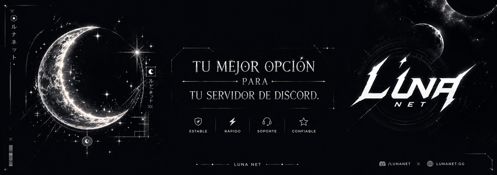
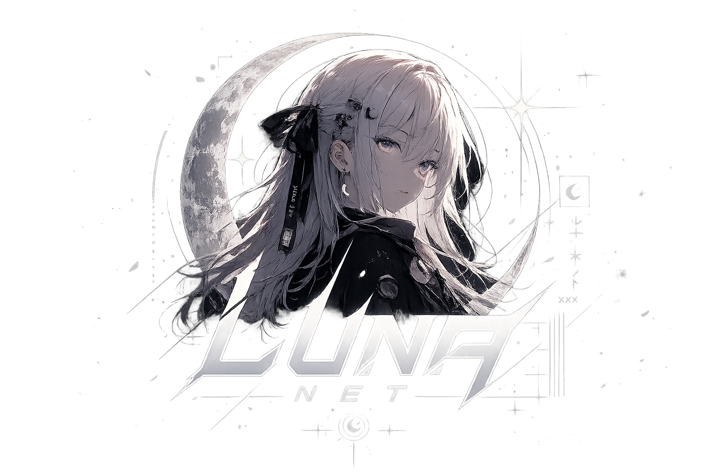
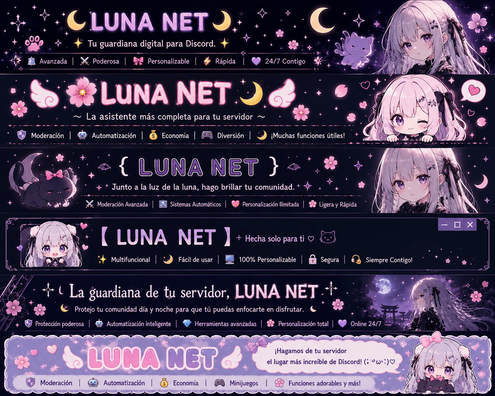
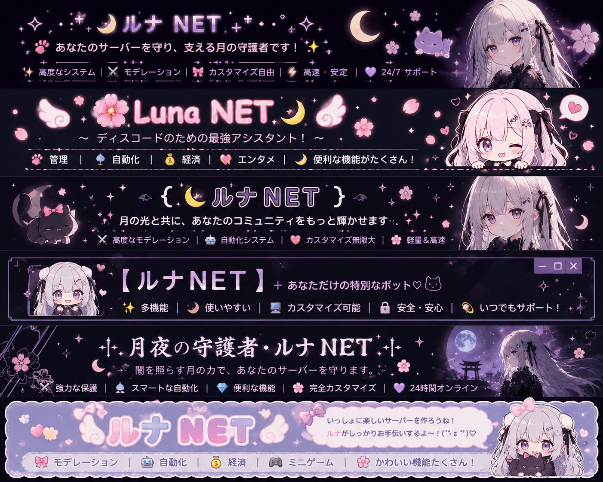
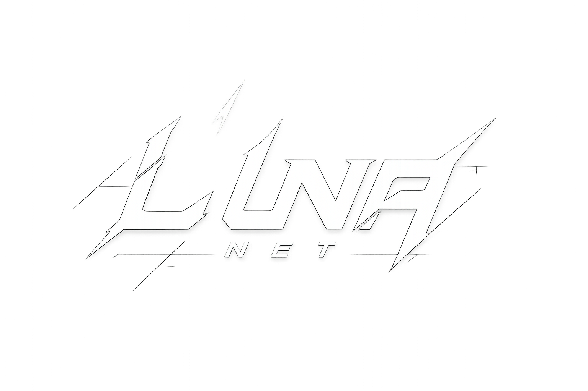

<!-- ╔══════════════════════════════════════════════════════════════╗ -->
<!--                  🌙 LUNA NET — README (v2.0.9)                    -->
<!--   Producto cerrado de Moon Studios. Las imágenes viven en         -->
<!--   ./assets/ — ajusta las rutas si cambias la estructura.          -->
<!-- ╚══════════════════════════════════════════════════════════════╝ -->

  

<h1 align="center">🌙 ルナネット &nbsp;|&nbsp; Luna NET</h1>

  <i>「月が導く、新しい物語へ。」</i> 
  <b>"La luna guiará el futuro de las comunidades digitales."</b>

  
  
  
  
  
  

  <a href="#-añadir-luna-net">Añadir bot</a> •
  <a href="#-funciones-actuales">Funciones</a> •
  <a href="#-premium">Premium</a> •
  <a href="#-novedades">Novedades</a> •
  <a href="#-roadmap">Roadmap</a> •
  <a href="#-soporte--enlaces">Soporte</a>

---

## 📑 Tabla de contenidos

- [🌸 Introducción](#-introducción)
- [📥 Añadir Luna NET](#-añadir-luna-net)
- [✨ Funciones actuales](#-funciones-actuales)
- [💎 Premium](#-premium)
- [🎐 Dashboard](#-dashboard)
- [🤖 IA de Luna y traducción](#-ia-de-luna-y-traducción)
- [🔒 Seguridad & Privacidad](#-seguridad--privacidad)
- [📜 Novedades](#-novedades)
- [🗺️ Roadmap](#-roadmap)
- [⚖️ Legal](#-legal)
- [🪪 Licencia](#-licencia)
- [🖼️ Galería](#-galería)
- [💜 Soporte & enlaces](#-soporte--enlaces)

---

## 🌸 Introducción

  

**Luna NET** es un bot todo-en-uno para Discord desarrollado por **Moon Studios**, con una identidad propia inspirada en la **estética anime** y la **cultura japonesa**. Reúne moderación, niveles, tickets, música, perfiles, traducción y un panel de control web en una sola asistente, con una personalidad potenciada por **IA**.

El objetivo no es ser "un bot más", sino que cada comunidad sienta que tiene una asistente con personalidad e identidad visual propias.

> 🌙 **Filosofía**
> No queremos crear un bot más. Queremos crear **una experiencia**.

| | |
|---|---|
| 🛡️ **Completa** | Moderación, niveles, tickets, música y más |
| 🎐 **Con panel web** | Configura todo desde el Dashboard, sin comandos |
| 🌐 **Multilingüe** | Auto-traducción en tiempo real ES ⇄ JP |
| ⚡ **Estable** | Infraestructura en Google Cloud / Firebase |
| 🔒 **Segura** | El contenido de tus mensajes no se almacena |
| 💜 **Activa** | En desarrollo continuo por Moon Studios |

---

## 📥 Añadir Luna NET

1. Entra al sitio web oficial y pulsa **"Añadir a Discord"**, o usa el botón de invitación del bot.
2. Selecciona tu servidor y aprueba los permisos.
3. Abre el **Dashboard** para configurar las funciones a tu gusto.

> 🔗 Web oficial: `lunanet.nellyx.xyz` · Soporte: [discord.gg/5dR8p733Ac](https://discord.gg/5dR8p733Ac)
>
> ⚠️ *Pega aquí el enlace de invitación real del bot (la URL de autorización OAuth2 de Discord).*

---

## ✨ Funciones actuales

Lo que Luna NET ya hace hoy en tu servidor:

- 🛡️ **Moderación** — herramientas de gestión y control para administradores.
- 📈 **Niveles, XP y rankings** — sube de nivel por actividad, con ranking por servidor y campeón global.
- 🎫 **Tickets** — sistema de tickets de soporte para tu comunidad.
- 🎵 **Música** — reproducción de música en canales de voz.
- 💤 **AFK** — marca tu ausencia con `/afk`; Luna avisa cuando te mencionen.
- 🎂 **Cumpleaños** — felicitaciones automáticas con `/birthday` (solo día y mes, opcional y desactivable).
- 🪪 **Perfiles** — perfil de usuario personalizable (biografía y campos propios).
- 🎭 **Paneles de roles** — autorroles mediante paneles configurables.
- 👋 **Bienvenidas** — mensajes de bienvenida configurables.
- 🤖 **IA de Luna (Groq · LLaMA)** — la personalidad y las respuestas de Luna están potenciadas por IA. *(No guarda historial ni aprende de las conversaciones.)*
- 🌐 **Auto-traducción** — traducción de mensajes en tiempo real (opt-in por servidor).
- 🎐 **Dashboard web** — control total desde el navegador con inicio de sesión por Discord.

> 💡 Escribe `/help` en tu servidor para ver la lista completa de comandos.

---

## 💎 Premium

Luna NET ofrece un plan **Premium** opcional con funciones y beneficios ampliados.

- Pagos gestionados de forma segura mediante **PayPal** y **MercadoPago**.
- Moon Studios no tiene acceso a tus datos bancarios completos.
- Consulta beneficios y precios actuales en la web oficial o en el servidor de soporte.

> ⚠️ *Añade aquí la tabla de beneficios y precios reales del plan Premium.*

---

## 🎐 Dashboard

El **Dashboard web** es el centro de control de Luna NET: configura cada función sin escribir comandos.

- Inicio de sesión seguro con **Discord OAuth2**.
- Configuración de bienvenidas, tickets, paneles de roles, niveles e idioma.
- Recuerda tu servidor seleccionado y tus preferencias.
- Interfaz inspirada en anime, pensada también para móvil.

---

## 🤖 IA de Luna y traducción

La personalidad y las respuestas de Luna están potenciadas por **inteligencia artificial** (API de **Groq**, modelos **LLaMA**): genera texto con su estilo propio a partir de instrucciones predefinidas, y traduce mensajes en tiempo real **ES ⇄ JP** (y otros idiomas).

- 🧠 La IA da voz a la personalidad de Luna; **no guarda historial de conversaciones ni aprende** de ellas: cada respuesta se genera de forma puntual.
- 🌐 La **auto-traducción** es opt-in: solo funciona si un administrador la activa en el servidor.
- 🔒 El texto necesario se procesa de forma transitoria y **no se almacena**. Según su política, Groq no retiene los datos.

> 📄 Reflejado en la [Política de Privacidad](./PRIVACY.md) y en los [Términos](./TERMS.md).

---

## 🔒 Seguridad & Privacidad

La privacidad es una prioridad. En resumen:

- 🗄️ Los datos se almacenan en **Firebase / Firestore (Google Cloud)**, con cifrado en reposo (AES-256) y en tránsito (TLS/HTTPS).
- 🚫 **El contenido de tus mensajes no se almacena.** Solo se procesa de forma transitoria para ejecutar comandos, otorgar XP, traducir y generar las respuestas de la IA, y se descarta enseguida. La IA no guarda historial de conversaciones.
- 🔐 El acceso a la base de datos está restringido por reglas de seguridad de Firebase y solo es accesible por personal autorizado de Moon Studios.
- 🗑️ Puedes solicitar la eliminación total de tus datos (plazo máximo de 30 días) por el servidor de soporte o por correo.

📄 Detalles completos en los documentos legales más abajo.

---

## 📜 Novedades

> 🗒️ Sigue [Keep a Changelog](https://keepachangelog.com/es-ES/) y [SemVer](https://semver.org/lang/es/).
> ⚠️ **Rellena esta sección con los cambios reales de cada versión.** Las entradas de abajo son una plantilla de ejemplo.

### `v2.0.9` — *(añadir fecha)*

**✨ Añadido**
- *(nuevas funciones de esta versión)*

**🎨 Estilos / Mejoras visuales**
- *(cambios de interfaz, nuevos banners o temas)*

**🔧 Cambiado**
- *(mejoras de rendimiento, ajustes de comandos)*

**🐛 Corregido**
- *(errores solucionados)*

> Versiones anteriores: *(añade aquí el histórico de `v2.0.x` y `v1.x`)*.

---

## 🗺️ Roadmap

Lo que viene para Luna NET. *(Funciones planeadas, aún no disponibles.)*

- [ ] 🧠 **Memoria y contexto conversacional** — que la IA recuerde el hilo de la charla y permita personalizar más su personalidad por servidor.
- [ ] 🇯🇵 **Japanese Experience** — eventos estacionales y referencias culturales (Hanami, Tanabata, Tsukimi…).
- [ ] 🎆 **Dynamic Events System** — eventos globales con recompensas, adaptados por región.
- [ ] 🎨 **Personalización avanzada** — temas, colores y widgets exclusivos por servidor.
- [ ] 🎐 **Dashboard Evolution** — nueva interfaz, animaciones y mejoras de rendimiento.

> ✅ El uso actual de IA (respuestas y traducción vía Groq) ya está reflejado en la Política de Privacidad. Si más adelante añades **memoria conversacional**, vuelve a actualizarla.

---

## ⚖️ Legal

Documentos legales de Luna NET (Moon Studios) — última actualización: **22 de marzo de 2026**.

- 🔐 **Política de Privacidad** → [`PRIVACY.md`](./PRIVACY.md) · [versión web](https://luna-net.netlify.app/privacy-policy)
- 📜 **Términos de Servicio** → [`TERMS.md`](./TERMS.md)
- 🍪 **Política de Cookies** → [`COOKIES.md`](./COOKIES.md)
- 📧 Contacto de privacidad: `studios.soporteplaykia@gmail.com`

---

## 🪪 Licencia

**Software propietario.** © 2026 Moon Studios. Todos los derechos reservados.

Luna NET **no es de código abierto**. Todo el código, diseño, marca, nombre, logotipos y recursos visuales son propiedad exclusiva de Moon Studios. Queda prohibido copiar, redistribuir, modificar, crear obras derivadas o realizar ingeniería inversa sin autorización expresa y por escrito.

Consulta el archivo [`LICENSE`](./LICENSE) y los [`TERMS.md`](./TERMS.md) para los detalles completos.

---

## 🖼️ Galería

🌸 Banners — Español

 

  

🇯🇵 Banners — 日本語

 

  

  

---

## 💜 Soporte & enlaces

  
  
  

- 🌐 **Sitio web:** `lunanet.nellyx.xyz`
- 💬 **Servidor de soporte:** [discord.gg/5dR8p733Ac](https://discord.gg/5dR8p733Ac)
- 📧 **Correo:** `studios.soporteplaykia@gmail.com`

> ⚠️ **Dominio:** tu marca aparece en tres direcciones distintas — `lunanet.gg` (en los banners), `luna-net.netlify.app` (el enlace que me diste) y `lunanet.nellyx.xyz` (el dominio que tu propio sitio declara como canónico). Usé este último; **confirma cuál es el oficial y deja solo ese** en todo el README.

---

  <i>━━━━━━━━━━━━━━━━━━━━</i> 
  🌙 <b>ルナネット</b> 
  ✨ Anime × Comunidad × Innovación 
  ⚡ El futuro de Discord comienza aquí. 
  <i>━━━━━━━━━━━━━━━━━━━━</i>

  Desarrollado con 💜 por <b>Moon Studios</b>, bajo la luz de la luna.

